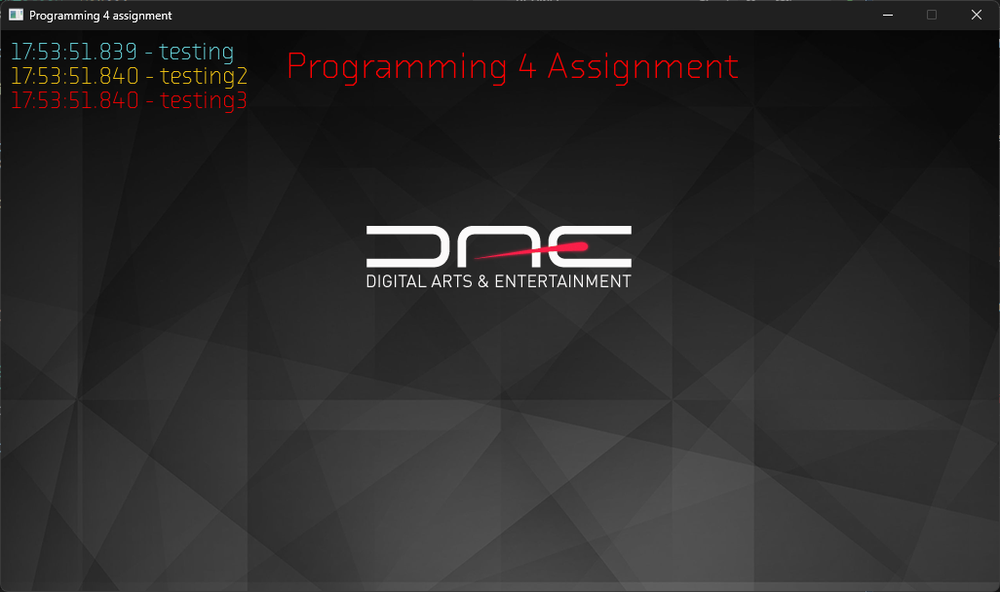
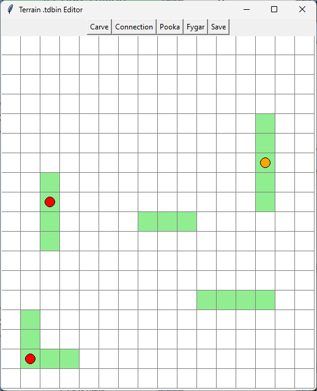
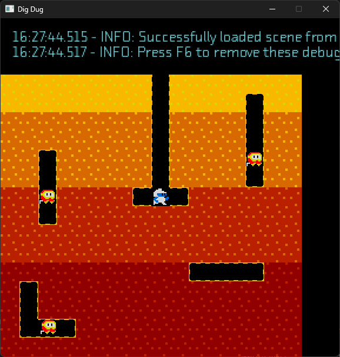
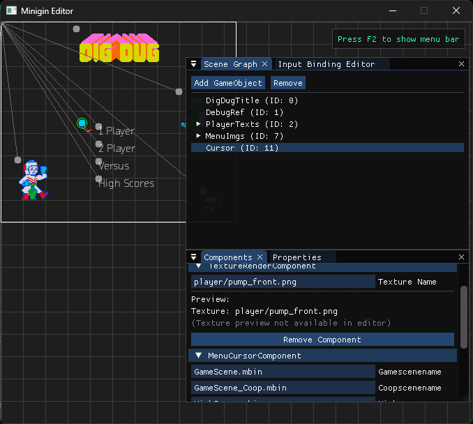

# Minigin

Minigin is a very small project using [SDL3](https://www.libsdl.org/) and [glm](https://github.com/g-truc/glm) for 2D c++ game projects. It is in no way a game engine, only a barebone start project where everything sdl related has been set up. It contains glm for vector math, to aleviate the need to write custom vector and matrix classes.

[](https://github.com/Coockie1173/Prog4-DigDug/actions/workflows/cmake.yml)
[](https://github.com/Coockie1173/Prog4-DigDug/actions/workflows/emscripten.yml)


# Prog 4 DigDug
This project aims to recreate DigDug using [Minigin](https://github.com/avadae/minigin). Although it passes all checks, due to this project using multithreading you can't actually see the emscriptem build in action.
It consists out of four distinct parts:
- Game
- Minigin
- Editor
- Shared
- Component Precompiler
Along with a smaller sixth entry, the tdeditor.
Each part serves it's own distinct purpose.

# Quick overview
## Game
The game portion of the project houses all game logic code. Anything related to player movement, enemy movement, how the main menu works, etc. 
This part also is what actually launches the project, not minigin! It does however, immediately make an instance of Minigin (which handles all the startup).

## Minigin
Heavily modified version of the earlier linked [Minigin](https://github.com/avadae/minigin). Contains all the base engine logic, from sound services to a lot of events!

## Editor
A custom built editor, supporting the custom made mbin format.

## Shared
Unlike what you might think, this isn't shared data betwween the game and [Minigin](https://github.com/avadae/minigin). This library is meant for the shared data between the Editor and the Game/Engine.

## ComponentPrecompiler
Because I thought it'd be cool to "have all the components be known at compile time" rather than "read in from a file" (like a sane person), I made a componentprecompiler, which runs before every build. This populates the componenttypemap with all the required information (mainly just a hash and then the name of the component, and what fields are accessible)

## tdeditor
Since the mbin editor isn't *quite* designed to work for generating terrains (which this game kind of relies on?), we have a separate tdbin format. This just says "hey, this tile is air, oh and on this tile a pooka or a fygar spawns!". It's a very simple python script that just serializes it to a bin file.

# Engine flow
This engine works on a basic Gameobject -> Component system. Upon boot it'll initialise a bunch of systems, including things like the debugger. This debugger will display warnings and errors to the screen.

After that it'll register our SDL soundsystem, initialize our Renderer and our ResourceManager. Both of these are lifted straight from [Minigin](https://github.com/avadae/minigin).
Once all our base systems are loaded in, we'll load in our default scene (which is sadly hardcoded to be the main menu). You can also just pass a scene via the command line and it'll laod that instead.
It'll deserialize our aforementioned mbin file. As mentioned earlier it's a rather simple file format.

| Offset | Size | Type | Value | Description |
|--------|------|------|-------|-------------|
| 0 | 4 bytes | `char[4]` | `"MBIN"` | Magic number / file identifier |
| 4 | 4 bytes | `uint32` | `1` | Format version (only version `1` is supported) |
| 8 | — | Section | — | Input Bindings |
| — | — | Section | — | Axis Bindings |
| — | — | Section | — | Game Objects |

Starts with our magic bytes (they spell out mbin, clever, I know). Then our version number, but because I simply forgot I HAD a version number, we only support version 1!
Then we go over into three distinct sections. 
Format here is simple: How many input bindings do I have?  And past that it's that many Input Bindings.
| Field | Type | Description |
|-------|------|-------------|
| `actionName` | `string` | Name of the action (length-prefixed string via `ReadString`) |
| `deviceType` | `uint8` | Input device type: `0` = Keyboard, `1` = Gamepad |
| *(if Keyboard)* `keyCode` | `T` | Key code value (type inferred from `ReadData`) |
| *(if Gamepad)* `gamepadIndex` | `T` | Index of the gamepad |
| *(if Gamepad)* `buttonIndex` | `uint8` | Cast to `GamepadButton` enum |

Then we get to axis bindings, which is much of the same. These are designed for joysticks and anything that is considered an analogue input.
Starts with an AxisInputCount again, then going over into the binary data.

| Field | Type | Description |
|-------|------|-------------|
| `actionName` | `string` | Name of the action |
| `deviceType` | `uint8` | Input device type: `0` = Keyboard, `1` = Gamepad |
| *(if Gamepad)* `gamepadIndex` | `T` | Index of the gamepad |
| *(if Gamepad)* `axisIndex` | `uint8` | Cast to `GamepadAxis` enum |
| *(if Gamepad)* `deadzone` | `T` | Deadzone threshold value |
| *(if Keyboard)* `positiveKey` | `T` | Key that maps to the positive axis direction |
| *(if Keyboard)* `negativeKey` | `T` | Key that maps to the negative axis direction |

After the axis bindings, we get to the Game Objects. These are slightly more complex (and have a little bit of redundant information, but hey! it works!).
Again it starts out with an ObjectCount, after which we have the following layout:
| Field | Type | Description |
|-------|------|-------------|
| `id` | `T` | Unique identifier for the game object |
| `name` | `string` | Human-readable name |
| `parentId` | `T` | ID of the parent object (for scene hierarchy) |
| `worldPosition.x` | `T` | World-space X position |
| `worldPosition.y` | `T` | World-space Y position |
| `isDebug` | `T` | Debug flag |
| `componentCount` | `uint32` | Number of components attached to this object |

Immediately after this componentCount we have our components rather than more info on our GameObjects (this makes sense, we can immediately attach our components to our GameObjects).
Our components are mapped out as follows:
| Field | Type | Description |
|-------|------|-------------|
| `componentTypeHash` | `T` | Hash used for look up
| `componentName` | `string` | Human-readable component name |
| `properties` | `map` | Key-value property map, read via `ReadMap` |

After this we have all the individual properties of our component for deserialization.

All this data then gets converted to actual GameObjects rather than Object "husks", and get sent over to the scene. Some extra reparenting happens to restore the hierarchy from the original editor scene using ParentId. All our buttons and joysticks get bound shortly after as well.

Components make themselves known via the ComponentFactory. Each component does this via the Registry. They do this by doing
```cpp
 const bool EnemyComponentRegistered = dae::RegisterComponentFactoryFor<dae::EnemyComponent>(dae::HASH_EnemyComponent);
 ```
This will run at some point during startup, during static init. This registration can be done from within their own cpp file. Makes adding new Components a breeze, since they'll instantly work with serialization and deserializtion*

Once all that is done the engine will start it's main loop.
- Calculate delta time
- Process input
- Init scenes (if that hasn't happened yet)
  - This is because some GameObjects or Components rely on others being available/spawned, so you load in the full scene first before calling Init on all your objects and components.
- Run Update()
- Run LateUpdate() in the rare case we need it (I think it was redundant in my engine? I don't recall ever needing it).
- Run Cleanup(), since some objects will mark themselves as invalid we have to swing by and take care of them.
- Run Render(), go over all objects and show them off

Now I don't have the time (nor energy) to go over every piece of the software individually, so I'll pick n choose some bits of the architecture.
A lot of the game's logic relies on the Game Manager. This game manager keeps track of a whole bunch of things, under the hood of "GameData".
```cpp
	struct TerrainSnapshot
	{
		TerrainSnapshot() = default;
		std::vector<uint8_t> cells;
		std::vector<uint8_t> cellWalls;
		int width{ 0 };
		int height{ 0 };
	};

	struct GameData
	{
	public:
		GameData() = default;
		bool m_IsSoloGame{ false };
		bool m_IsVSGame{ false };
		bool m_IsRespawn{ false };

		int m_Lives{ 0 };
		int m_LevelNo{ 0 };
		int m_Score{ 0 };
		int m_EnemyCount{ 0 };
		int m_RockCrushCount{ 0 };

		std::optional<TerrainSnapshot> m_TerrainSnapshot{};
	};
```
This tells us what gamemode we selected, how many lives we have left, which level we're in, etc you can read the rest.
Although it says we have a vs gamemode, I did not get around to implementing that. The TerrainSnapshot is a copy of our Terrain within the level, this gets set upon PlayerDeath (so if m_IsRspawn is set) so when the scene reloads, our terrain remains MOSTLY unchanged (the rocks will move about).
The GameManager also heavily relies on Events. It'll listen players scoring, or a player losing a life, or a player winning a level, or my personal favourite:
```cpp
m_KILLKILLKILLEvent = EventManager::GetInstance().Subscribe(InputManager::ENEMYKILLDEBUGKILLHASH,
    [this](unsigned int, const std::any&)
    {
        for (int i = m_Data.m_EnemyCount; i >= 0; --i)
        {
            EventManager::GetInstance().Publish(EnemyComponent::ENEMYDEATHHASH);
        }
    }
    );
```
(skip level feature ^)

Our next neat little tidbit we have in the project is our StateHelper.
The StateHelper is designed for easy management over StatePools. It takes the best of both worlds, it won't pre-allocate too much, but it also won't de-allocate unneeded things.
```cpp
template<typename T>
class StatePool
{
public:
	StatePool() = default;
	~StatePool() = default;

	template<class S> S* Get()
	{
		static_assert(std::is_base_of<T, S>::value, "S must be a subclass of T");
		for (auto& state : m_StatePool)
		{
			if (auto castedState = dynamic_cast<S*>(state.get()))
			{
				return castedState;
			}
		}
		auto newState = std::make_unique<S>(this);
		auto newStatePtr = newState.get();
		m_StatePool.push_back(std::move(newState));
		return newStatePtr;
	}

private:
	std::vector<std::unique_ptr<T>> m_StatePool;
};
```
In this case our S here is our inherited State class, S must inherit from T. You'd define your statepool as something like
```cpp
StatePool<EnemyState>* m_pStatePool{ nullptr };
```
and then you can invoke any state via
```cpp
m_pStatePool.Get<CoolState>();
```
and if the state doesn't exist yet, it'll allocate one, if it does exist it'll just send it over for you!

When it actually comes to loading in the terrain from the game, we have a very simple python program (as mentioned before).
The td format is very simple:
- "how many cells are carved?"
- "read them out"
- "how many connections do we have"
- "zero because this feature did NOT work"
- "how many enemies do we have and what type"
- "read them out"



Notice how there's only pookas in this screenshot. This bug has since been fixed.

The input system of this game runs on Commands. After careful consideration I have come to the conclusion: I don't think I used them right thus they weren't fun to use. Whatever the case, you have the ability to bind Keyboard buttons, gamepad buttons, and axis to commands! (an axis is either a joystick or a +/- keyboard bind).
These are bound in two steps. You bind a button or an axis, this creates an Action or Axis binding. These all get a name (like Horizontal or Vertical).
Then once you bind a command, it'll attach the command to the name. So whenever a button is pressed, held or released, it'll run all those ActionBindings, running those commands.
The input system is also the only instance of weak pointers being used in the software. This *was* intentional believe it or not!
Why? I hear you ask. The weak pointers serve as a "is this command still in use" flag. Multiple objects can "own" the same Command, so when they register at the inputmanager he'd like to know that. However he doesn't want to be influencing the usage count himself (since this is unneeded addition and subtraction), so he isntead is a weak pointer that just checks "oh is this channel still used". If it isn't used anymore, the system will throw out said Command from it's memory since it isn't needed anymore.
```cpp
auto executeAction = [this](const std::string& action, InputType inputType)
    {
        auto bindingIt = std::find_if(m_ActionBindings.begin(), m_ActionBindings.end(),
            [&action, inputType](const std::unique_ptr<ActionBinding>& binding)
            {
                return binding->action == action && binding->inputType == inputType;
            });

        if (bindingIt == m_ActionBindings.end())
            return;

        auto& cmds = (*bindingIt)->commands;
        cmds.erase(
            std::remove_if(cmds.begin(), cmds.end(),
                [](auto& weakCmd)
                {
                    if (auto cmd = weakCmd.lock())
                    {
                        cmd->Execute();
                        return false;
                    }
                    return true;
                }),
            cmds.end());
    };
```

The, what I think to be, superior Events system runs on something similar but not quite the same. Events work on a subscription basis.
Take our chunk of code from earlier.
```cpp
m_KILLKILLKILLEvent = EventManager::GetInstance().Subscribe(InputManager::ENEMYKILLDEBUGKILLHASH,
    [this](unsigned int, const std::any&)
    {
        for (int i = m_Data.m_EnemyCount; i >= 0; --i)
        {
            EventManager::GetInstance().Publish(EnemyComponent::ENEMYDEATHHASH);
        }
    }
    );
```
The Subscribe function takes in an unsigned int rather than a string (it's a hashed string), and when something gets published to said Event, it'll run the attached function. This is an incredibly incredibly INCREDIBLY flexible system, which is used all throughout my project. Want to change level? Just call the event!
```cpp
EventManager::GetInstance().Publish(SceneManager::CHANGELEVELHASH, m_GameSceneName);
```
"Can't you just use a singleton for that" yeah but where is the fun in that. In all seriousness tho this allowed me to easily talk between a bunch of systems without necessarily having them live in global space. Don't get me wrong, I like me a good singleton, but Events are just that tiny bit better.
The hashes are also precalculated during compile time by simply doing
```cpp
static constexpr auto SUBMITSCOREHASH = make_sdbm_hash("Player Submits Score");
```

A horible little piece of code in the project is our Precompiler. It'll scan both the engine's and the games' Component directories, read in the header and generate a file based from that.
Components can therefore expose some data to said editor by doing
```cpp
// EXPOSE_TO_EDITOR("Input Scheme", "Defines the input scheme as follows: horizontal|vertical")
std::string m_inputScheme{};
```

"But what if I don't want my component to be available in the editor?" - super valid question. To do that you place
```cpp
// NOEXPOSE
```
The precompiler will generate a bunch of hashes (that's a lie it'll make a bunch of constexpr).
```cpp
inline constexpr auto HASH_FPSCounterComponent = make_sdbm_hash("FPSCounterComponent");
inline constexpr auto HASH_SpinnerComponent = make_sdbm_hash("SpinnerComponent");
inline constexpr auto HASH_SwappableRenderComponent = make_sdbm_hash("SwappableRenderComponent");
inline constexpr auto HASH_TextRenderComponent = make_sdbm_hash("TextRenderComponent");
```
This precompiler will also generate a cpp file called "ComponentRegisterMaster.cpp". This is one big file telling our editor what properties our components have.
```cpp
ComponentMetadata{
                "TerrainGridComponent",
                "TerrainGridComponent_Barebones",
                make_sdbm_hash("TerrainGridComponent"),
                {
                    PropertyMetadata{
                        "int",
                        "Width",
                        "Width",
                        "Number of cells horizontally"
                    },
                    PropertyMetadata{
                        "int",
                        "Height",
                        "Height",
                        "Number of cells vertically"
                    },
                    PropertyMetadata{
                        "float",
                        "CellSize",
                        "Cell Size",
                        "Size of a single terrain cell in world units"
                    }
                }
            }
```
This file is fully autogenerated based on the precompiler, which is very neat!
Speaking of the editor, this janky piece of software can load and edit mbin files (granted MSVC works along).


Now I can hear the question "why did you make the td editor if you have this perfectly functioning editor". The answer is very simple: I did NOT want to make one big grid in that editor!

Now back to our engine. It supports sounds! And I really like the bit of code I wrote for said audio engine. It runs on a separate thread, and to not lose too much time waiting for the worker to finish playing audio, or wasting several frames playing one audio at a time, I just yoink the entire queue from the main thread and place it onto the worker threat. This both clears out the main thread's soundqueue, but also instantly populates the one for the worker!
```cpp
void sound_system_SDL::Worker(std::stop_token st)
{
    std::unique_lock lock(m_mutex);

    while (true)
    {
        m_cv.wait(lock, [&] 
            {
                return !m_soundQueue.empty() || st.stop_requested();
            });

        if (st.stop_requested() && m_soundQueue.empty())
            break;

        std::vector<std::string> soundsToPlay;
        soundsToPlay.swap(m_soundQueue);

        lock.unlock();
        for (auto& sound : soundsToPlay)
        {
            if (m_muted)
                continue;

            auto audioIt = m_audioCache.find(sound);
            if (audioIt == m_audioCache.end())
            {
                auto audio = std::unique_ptr<MIX_Audio, AudioDeleter>{MIX_LoadAudio(m_mixer.get(), sound.c_str(), false)};
                if (audio)
                {
                    audioIt = m_audioCache.emplace(sound, std::move(audio)).first;
                }
                else
                {
                    SDL_Log("Failed to load sound '%s': %s", sound.c_str(), SDL_GetError());
                }
            }

            if (audioIt != m_audioCache.end() && audioIt->second)
            {
                MIX_PlayAudio(m_mixer.get(), audioIt->second.get());
            }
        }

        lock.lock();
    }
}
```

# Usage
As per the github actions, this project should work any* compiler.
Opening this project with Microsoft Visual Studio 2026, it should recognise it's a cmake project and should just work from the getgo.
Otherwise the usage is like any other CMake project, in case you want to use a different compiler.
As mentioned earlier, because of the threading Emscriptem doesn't run properly. Yes it compiles, but it gives a blank screen.
In case you *still* want to see it, it can be found [here](https://coockie1173.github.io/Prog4-DigDug/).

~*Any of the listed github action compilers~

https://github.com/Coockie1173/Prog4-DigDug